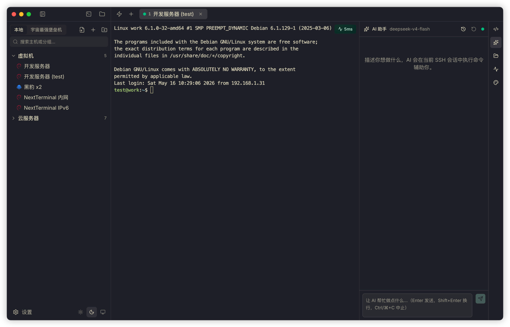
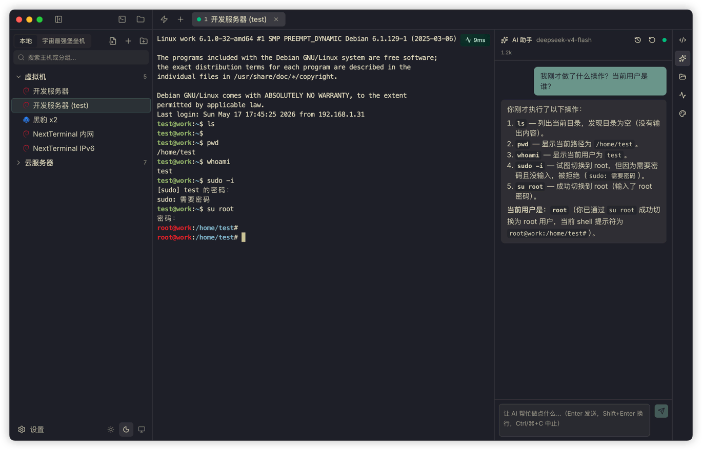
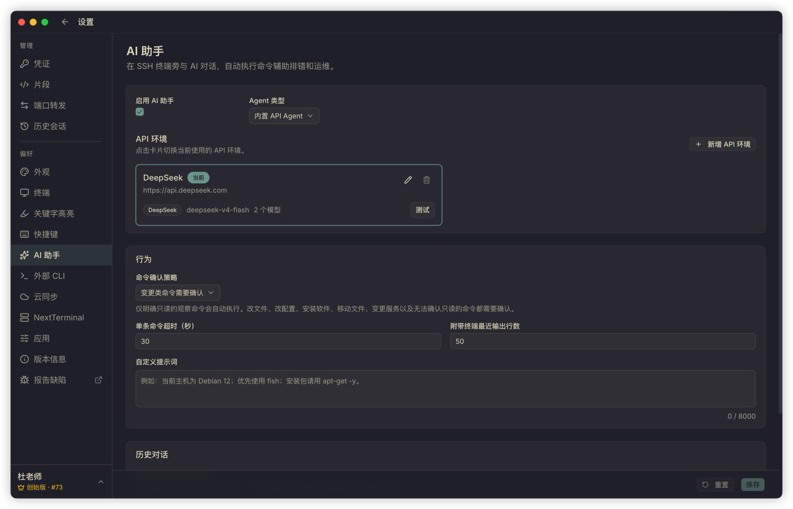
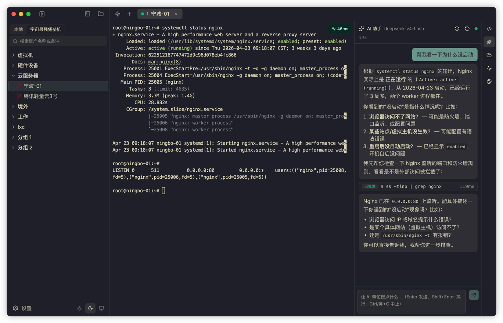
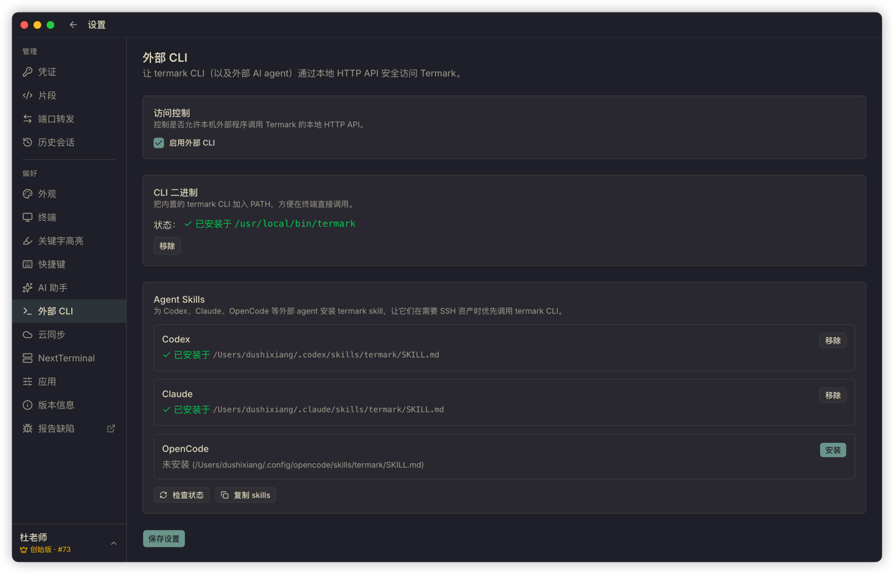
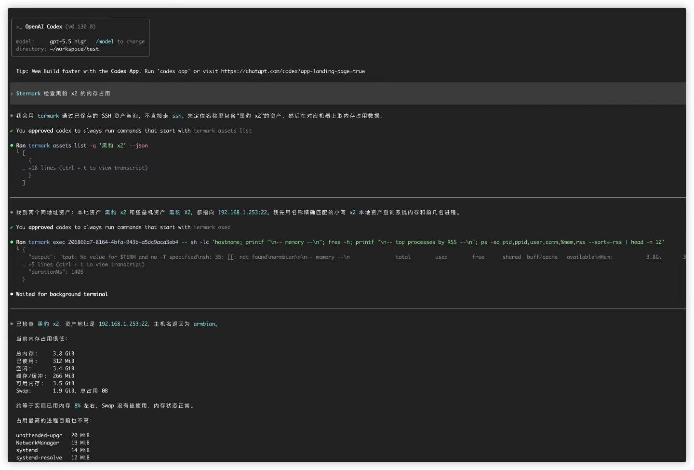

# Termark AI Assistant Design: Why I Did Not Build a Fully Autonomous Ops Agent

I built an AI assistant in my other product, NextTerminal, quite early on.

The first version was simple: users configured an API, a model, and a prompt in the backend, then opened a terminal and could ask, "How should I write this command?" The AI would return a command, and the user would decide whether to run it.


The feature was not complicated, but the feedback was decent. It solved a very specific problem: people working in terminals are often not completely stuck, they just need a fast direction finder, such as checking logs, inspecting processes, writing a `grep`, explaining an error message, or filling in a parameter they forgot.

I never pushed it further into a more aggressive "autonomous ops agent". The reason is simple: a server and a code repository are not the same thing.

If an AI deletes the wrong file in a code repository, most of the time you can still recover from git. On a Linux machine, one bad command can wipe logs, configs, database files, or even break a machine that is actively serving traffic.

When I later built Termark, I could have rethought the AI from scratch: how to provide context, what form the agent should take, whether to support external agents, and so on. But I did not change the conclusion I reached with NextTerminal. For server scenarios, the goal of AI is not to do more. The goal is to improve efficiency within a boundary you can control.

---

## From simple Q&A to something that actually stands beside the terminal

I am already heavily dependent on coding agents like Claude Code and Codex. One account quota is never enough, so I switch between different providers.

After using them for a while, a simple chat box next to the terminal feels insufficient. Real troubleshooting is not a user asking one question and the AI giving one answer. It is reading the latest terminal output, deciding what to inspect next, running a read-only command, continuing based on the result, and only then suggesting changes if needed.

That is why the AI assistant in Termark had to be an agent.

I still did not give it a pile of complicated capabilities from day one. Termark's core scene is the SSH terminal the user is currently looking at, so the tool boundary stays inside that session: inspect the terminal environment, execute commands, read files, search content, and, when needed, browse directories or write files. Everything ultimately maps to the current SSH session. The AI cannot bypass Termark and connect to the server on its own.



One difference from many agents is that Termark executes commands directly in the terminal the user is already watching. It does not open another shell in the background.

Two examples:

Right after `su - postgres`, if you ask, "Check the current connection count," the `psql` command runs in the postgres user's context. It does not mysteriously run as root, and it does not fail because the environment variables are wrong.

If you switch to `/var/log/nginx` and ask, "Are there a lot of 5xx responses in these access logs lately?" the `grep` runs directly in that directory. You do not need to pass an absolute path again, and it does not go looking on some other machine.

The more practical benefit is that if a command needs a database password, a second confirmation, `vim` editing, or `sudo` authorization, the user can continue typing right there in the terminal. It feels more like a person standing next to you typing into the current terminal than a background automation script.


<!-- Suggested image: AI running commands in the current terminal context, with the AI output visible in the user's real terminal rather than in a separate tool result panel. Ideally this should show a `su` user switch or directory change context. -->

The tradeoff is that you lose a little of the "fully automated" thrill, but you gain a consistent scene: the machine, user, and directory you are working in are always visible.

---

## Why I did not allow every command by default

The most annoying thing about AI agents is often having to confirm every step.

When writing code, repeatedly confirming `ls`, `cat`, and `rg` does interrupt flow. But the server scenario cannot copy that experience directly.

Termark works with SSH assets. That might be a personal VPS, or it might be production. When an AI says, "I will clean up some temporary files," it might actually be running `rm -rf`. When it says, "I will restart the service and check," it might affect live traffic. One word difference can mean a huge difference in outcome.

My strategy is straightforward: clearly read-only and observable commands are allowed by default. Anything that changes remote state, cannot be judged safe, or is ambiguous goes through confirmation.

There is a command risk detection layer in the code. It splits shell tokens and recognizes pipes, redirects, subshells, backticks, and command substitution. If a command contains write, delete, move, install, restart, permission change, or output redirection actions that may alter state, it must be confirmed. There is also a more conservative setting option: confirm every tool call.


I did not add a "developer mode: never confirm" switch.

It is not that I do not trust AI. The issue is that Termark supports OpenAI-compatible interfaces, and everyone can connect different models with very different capabilities and tool-call quality. Once you give people a "never confirm" switch, any failure happens on the user's server, not on mine.

---

## Built-in agent

Termark includes an OpenAI-compatible built-in agent path for people who want to use a model they choose without building an entire toolchain themselves.

You can configure multiple API profiles, including OpenAI, DeepSeek, OpenRouter, Qwen, Kimi, Ollama, or a custom interface. Each profile can set its own API endpoint, key, model list, current model, reasoning parameters, max retries, and custom User-Agent.




When I test it myself, I prefer using fast, cost-controlled models for frequent terminal assistance. That works because the context Termark gives the model is deliberately narrow: recent terminal output, the current session scope, the necessary system prompt, and the user's question. It does not dump the entire server state, and it does not throw in all history at once. Larger context means higher cost and more noise.

The most important piece is the recent terminal output. I do not want users to copy output manually every time and paste it into the AI, so Termark captures the last N lines from the current terminal and sends them as context automatically. N is configurable in settings.

So right after:

```bash
systemctl status nginx
```

you can ask:

```text
Help me figure out why it did not start.
```

The AI can analyze the output you just saw instead of asking, "Please provide the error log."



For day-to-day log interpretation, command generation, config inspection, and file search, that amount of context is usually enough.

Lightweight models obviously have limits. I did not position the built-in agent too aggressively. Its role is to be an assistant next to the terminal that can see the scene and execute limited commands, not to run an entire ops workflow for you. It is good for checking disks, ports, and errors; I do not encourage changing production config without confirmation.

---

## External CLI: for the agents you already use locally

There is another scenario in the opposite direction.

Some people already use Codex, Claude Code, or OpenCode heavily in their local terminal and do not want to switch to the Termark AI panel. The problem is that those local agents do not have access to the user's SSH assets by default. They do not know passwords, private keys, or jump host configuration, and from a security standpoint they should not know those things.

Termark handles this by providing an external CLI.

With a few clicks in the settings page, you can install the `termark` command into your PATH and also install the Termark skill into the skills directory of Codex, Claude, or OpenCode. After that, local agents can use termark:

```bash
termark assets list -q <keyword> --json
termark exec <asset-id> -- <command>
termark upload <asset-id> <local-path> <remote-path>
termark download <asset-id> <remote-path> <local-path>
```





The external CLI does not hold credentials directly. It reaches controlled capabilities through the running Termark desktop app, while credentials, jump hosts, and connection details stay inside Termark.

The things it can do are intentionally limited: search assets, inspect basic asset info, run one-off commands on a specific asset, and upload or download files. Do not keep long-running jobs attached to the external CLI; use `tmux`, `nohup`, or `systemd` on the remote side instead.

It is not meant to be a universal remote agent. It is just a safe way to let existing agents reach your servers.

---

## Two paths for two kinds of users

At this point, Termark's AI story really has two entry points.

One is the built-in OpenAI-compatible agent. Users choose the model they want, let the AI watch the SSH terminal scene, analyze problems, and execute controlled commands, while safety is enforced by Termark's confirmation strategy.

The other is the external CLI. The local agent workflow stays the same, but it gets a new command that can safely access Termark assets. Credentials do not go to the agent; they stay on the Termark side.

I did not want to force everyone into just one path. Some people care about integration cost and model choice. Others care about their existing workflow. Both entry points share the same assets, credentials, sessions, and safety policy. The only difference is which side you enter from.
