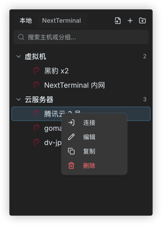
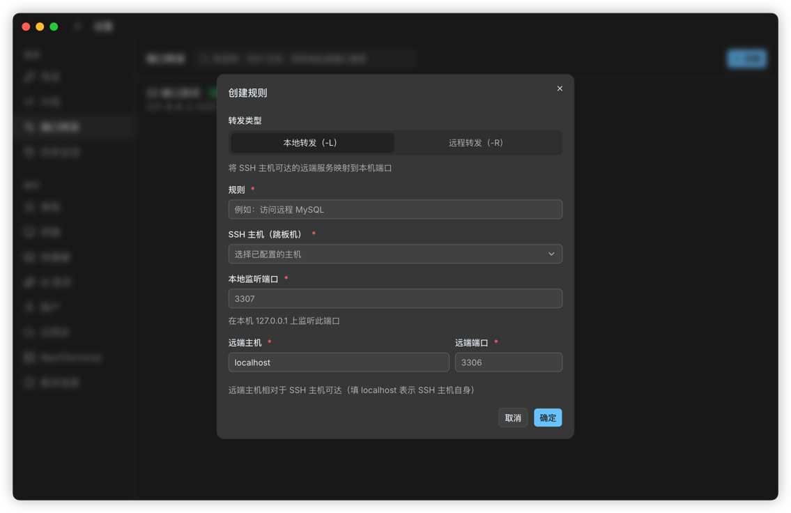
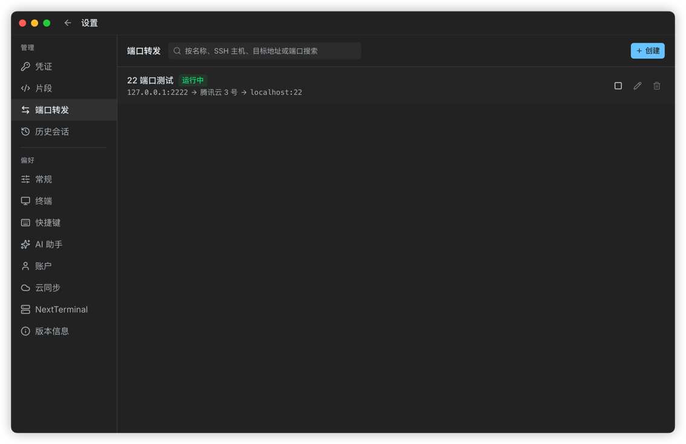
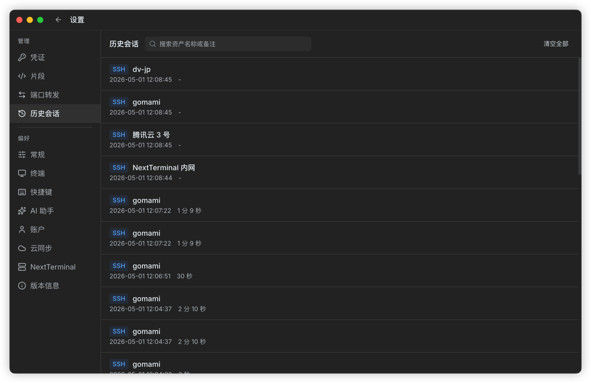
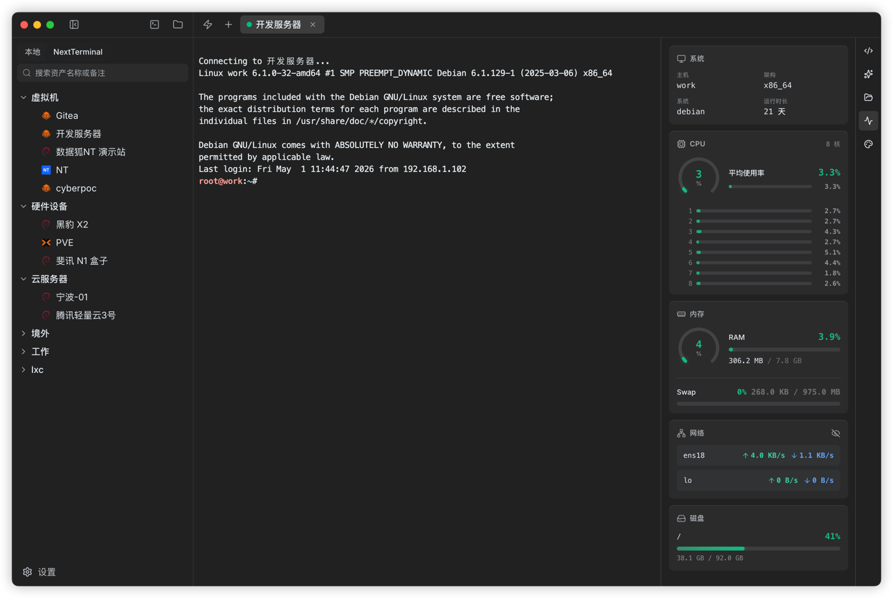

# I Built a More Convenient SSH Terminal Management Tool: Termark

If you work on backend systems, operations, or your own servers, this workflow will probably feel familiar:

Open a terminal and connect to a server;  
Open another tool to transfer files;  
Dig through notes to find a command;  
Look up a machine's account, key, or jump host configuration;  
When you need to run the same command on several machines, start copy-pasting into one window after another.

None of those tasks is hard by itself, but repeating them all day makes the work feel fragmented.

Termark was built to solve that fragmentation.

It is a desktop SSH terminal management tool. My goal was not just to build a terminal that can connect to servers, but to put asset management, terminal sessions, file transfer, port forwarding, command snippets, session history, sync, and AI assistance into one workspace.

---

## Why I built Termark

I use servers a lot myself, and the day-to-day workflow is not complicated, but it is easy for different tools to scatter it.

For example, troubleshooting a production issue might mean connecting through a jump host, entering the target machine, checking logs, inspecting processes, looking at ports, pulling configuration files, and downloading logs. If you also need to handle multiple machines, it gets worse.

The terminal itself only solves the "connect to it" part. A lot of real work happens after the connection is established.

So the idea behind Termark is: manage the server assets first, then provide the common actions around those assets.

A machine should not just be an IP address. It may belong to an environment, have its own credentials, proxy, jump host, startup command, file transfer entry point, historical sessions, and commonly used commands. Termark tries to keep those things together.

---

## Start with the asset tree

When Termark opens, the left side is an asset tree.

You can group servers however you like: production, staging, databases, gateways, customer projects, home NAS, whatever feels natural. Groups support multiple levels, search, and drag-and-drop ordering.

If you already have `~/.ssh/config`, you can import it directly instead of re-entering everything. If you need a bulk migration, you can also import from CSV.

Termark supports more than SSH hosts. It can manage and connect to:

- SSH
- Telnet
- Serial ports
- Local terminals
- NextTerminal assets

What I care about here is a "single entry point". Some old devices still use Telnet, some field devices rely on serial connections, and some teams already use NextTerminal. They may not be ideal, but they are real, and the tool should account for them.

---

## A terminal should feel natural, not merely usable

The terminal is built on xterm.js. Basic connection and I/O are only the first layer. The details you use every day are what really shape the experience.

Termark supports tabs, split panes, search, session cloning, auto reconnect, selection copy, right-click paste, themes, fonts, shortcuts, and keyword highlighting.

None of those are especially novel, but I think they all need to be stable parts of a terminal tool. In real usage, every fewer switch, every fewer retype, and every fewer search for a command makes the experience better.

The feature I use most myself is command snippets.

Docker cleanup, checking systemd service status, looking at recent error logs, checking disk usage, and restarting a service are not commands you should type from scratch every time. They also should not be scattered across chat logs and note apps. Save them as snippets and they are ready when you open the terminal.

Keyword highlighting is also useful. You can mark words like `ERROR`, `WARN`, and `failed`. When reading logs, you do not need to scan line by line; your eyes can get to the important parts faster.

---

## Repeating the same command on multiple machines should be easy

Some tasks are naturally batch-oriented.

Checking disk space across a group of machines, verifying whether a service is running everywhere, confirming that versions match after a release, or validating results in bulk are all examples.

The traditional approach is to open many windows and paste commands one by one. It works, but it is mechanical and easy to miss something.

In Termark, you select multiple assets and open the batch execution page. Each machine gets its own terminal panel, and you type the command once at the top to send it to all targets.

The output is not mixed together. Each machine stays separate, so you can dispatch once and inspect individually.

If you already saved common commands as snippets, you can use those directly in batch execution too.

---

## Keep SFTP next to the terminal

File transfer is another thing that often gets split into a separate tool.

Most of the time we are not trying to "manage files" as a standalone task. We just need to upload a config, download a log, tweak a small file, or inspect a directory during troubleshooting.

That is why Termark includes a built-in SFTP workspace. It uses a dual-panel layout, with local files on the left and remote files on the right. It supports upload, download, drag-and-drop, creating folders, creating files, renaming, deleting, permission changes, batch downloads, batch deletes, and transfer task inspection.

In an SSH terminal, you can also open the SFTP tab for the current session. With directory following enabled, switching directories in the terminal keeps SFTP aligned with the current working directory.

The point is simple: you should not have to switch to a different tool just to transfer a file.

---

## Port forwarding can be saved as a rule

SSH port forwarding is useful, but the command is hard to remember, especially once you have several forwards and forget which one maps to which service.

Termark supports local and remote forwarding, and you can save rules.

For example:

- Map a remote MySQL instance to a local port
- Reach an internal service through a jump host
- Temporarily expose a local debugging service to a remote machine
- Debug an endpoint that is only reachable from the server network

Once saved, you can start a rule with one click and stop it when you no longer need it. Compared with rebuilding `ssh -L` or `ssh -R` every time, it is much better for regular use.

---

## Credentials, jump hosts, and proxies should also be kept together

The annoying part of server connections is often not the IP address. It is the surrounding configuration.

What is the account? Password or private key? Does the key have a passphrase? Do you need a proxy? Do you need a jump host? How many jump layers? Should a startup command run after login? Does the old machine need special encoding?

If these details are stored separately, they will eventually become messy.

Termark includes credential management. You can save password credentials and private key credentials, and you can also generate key pairs, copy the public key, or install the key with a command. Hosts can bind directly to credentials so you do not have to re-enter them repeatedly.

Connection options also include direct SSH, multi-hop jump hosts, HTTP proxy, Socks5 proxy, connection timeout, environment variables, Backspace mode, encoding settings, and SFTP sudo elevation.

For local storage, sensitive fields like passwords, private keys, key passphrases, and proxy passwords are encrypted before being written to disk. They are not stored in plain text.

---

## Session history: some outputs are worth keeping

When you are troubleshooting, it is common to have a critical output in the terminal at one moment and lose track of it later.

Termark supports session recording. When enabled, terminal output can be saved into historical sessions for later replay, with notes and search.

It is useful for recording:

- A troubleshooting session
- A deployment output
- A key configuration change
- A postmortem for a mistake
- The historical connection record for a machine

This is not meant to be a full auditing system. It is more like a lightweight record for individuals and small teams. Very often, just being able to replay what happened is already valuable.

---

## AI assistant: helpful, but not in charge

Termark also includes an AI assistant.

I do not want to frame it as "autonomous ops". It is more like an assistant standing next to the SSH terminal: it can see the latest terminal output, can analyze problems based on your description, and can execute commands after you confirm them.

For example, you can ask it to explain an error message, check service status, analyze port usage, or decide what to inspect next based on the current output.

The AI assistant supports OpenAI-compatible interfaces. You can configure your own API endpoint, key, and model, including services compatible with OpenAI, DeepSeek, Qwen, Kimi, Ollama, and others.

I am conservative about command execution.

Termark supports two confirmation policies: confirm only dangerous commands, or confirm every command. High-risk commands such as `rm -rf /`, `mkfs`, disk writes with `dd`, restarts, shutdowns, and firewall wipes are recognized and require confirmation.

My view is simple: AI can improve efficiency, but control of the server must still stay with the user.

---

## Multi-device sync, but the server never sees plaintext

If you switch between a work laptop, a home machine, or multiple dev machines, unsynced assets and snippets quickly become frustrating.

Termark supports cloud sync for hosts, credentials, snippets, and configuration. Sync options include the official service, WebDAV, and S3-compatible object storage.

The important part here is the security model: sync data is encrypted on the client before upload. The sync password is never sent to the server, and the server only receives ciphertext. In other words, the server stores data, but it cannot decrypt your server information.

When multiple devices edit at the same time, Termark performs version conflict detection. If it finds a conflict, it asks you whether to restore from the cloud or overwrite the cloud data locally instead of silently replacing anything.

---

## If you already use NextTerminal

Termark also integrates with NextTerminal.

During setup, authorization happens in the browser, so you do not need to create an API token manually. After authorization, you can load SSH assets from NextTerminal into Termark's asset tree.

That means you do not have to choose between your existing asset system and a local desktop tool. Assets can stay managed by NextTerminal, while day-to-day connections, SFTP, batch execution, command snippets, and AI assistance happen in Termark.

---

## Who it is for

If you only log in to a server occasionally, Termark may not be necessary. A system terminal plus one SSH command is probably enough.

But if you often deal with these situations, Termark is more useful:

- You manage a lot of servers
- You often need jump hosts or proxies
- You have many common commands and do not want to retype them
- You frequently upload and download files
- You need to check multiple machines in bulk
- You want to keep some session history
- You want AI next to the real SSH session for troubleshooting
- You want to sync assets and configuration across multiple computers

It is not trying to replace every tool. It is trying to bring the most common remote-work workflow into one desktop app.

Less window switching, less repeated configuration, less copy and paste.

That is the problem Termark is trying to solve right now.

---

## Final note

Termark is still being iterated on.

If you work with servers often, feel free to try it, and feel free to share your real usage scenarios. Many features were not invented out of thin air; they grew out of daily work, one piece at a time.

Website: <https://termark.app>
