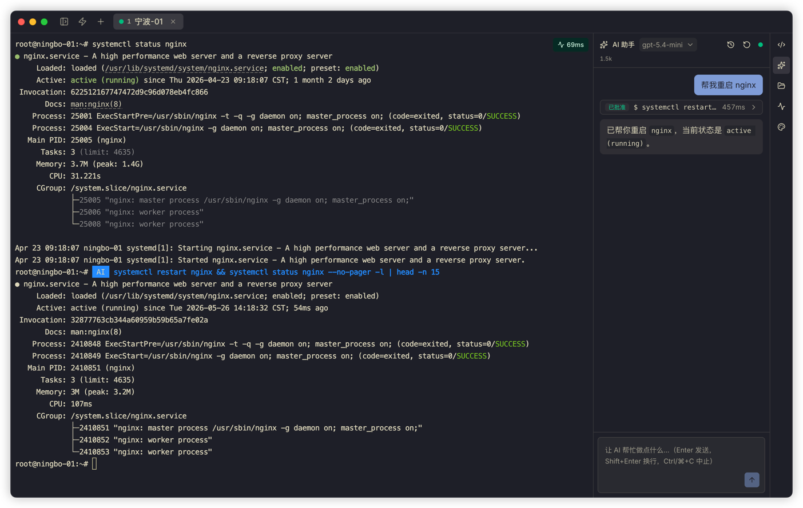
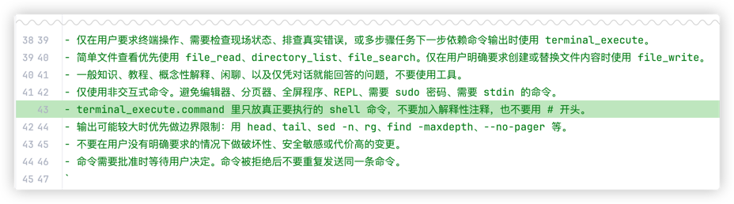

# The Curse of Knowledge in Large Models

The "curse of knowledge" means that once you know something, it becomes hard to explain it from the perspective of someone who does not.

Recently, I found that something similar can happen between large models.

---

I built an SSH client called Termark: [https://www.termark.app](https://www.termark.app). It includes an AI assistant that can analyze terminal output, generate troubleshooting commands, and execute them after confirmation.



In my own tests, DeepSeek-V4-Flash and GPT-5.4-mini handled common tasks without much trouble. For safety, Termark uses a command allowlist for AI execution: clearly safe read-only commands can pass, while other commands require user review.

Then a user reported a strange issue.

They asked, "I only wanted to view logs. Why did it still require review?"

At first, I did not understand it. Viewing logs usually means commands like `tail`, `grep`, or `journalctl`, which should pass the allowlist.

After the user sent a screenshot, I saw that their AI had generated something like this:

```bash
# View the latest 100 lines of logs
tail -n 100 /var/log/nginx/error.log
```

The command itself was fine, but there was a comment before it. Termark recognizes executable commands, not a full shell script with comments. When it saw content starting with `#`, it could not confirm that the command was safe, so it blocked it conservatively.

From a safety perspective, that was correct. From a product experience perspective, it felt awkward.

---

What made it more interesting was that I had asked a top model to help write the system prompt. It listed many "important rules", but missed one very simple rule:

**Only output executable commands. Do not put comments inside command blocks.**

---

So I now write this rule directly into the prompt, and of course I also improved the allowlist recognition logic:



This kind of rule looks dumb, but in a real product it is necessary.
