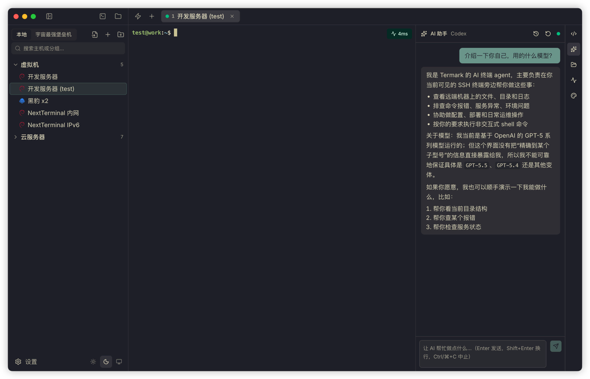

# Termark AI 助手设计：我为什么没有做一个"全自动运维 Agent"

在我另一款产品 NextTerminal 里，我很早就做过一个 AI 助手。

那时候的设计很简单：用户在后台配置 API、模型和提示词，打开终端后可以在旁边问一句"这个命令怎么写"。AI 输出命令，用户看一眼，再决定要不要执行。


功能并不复杂，但反馈还不错。

因为它解决的是一个很具体的问题：人在终端里工作，经常不是完全不会，而是需要一个能快速给出方向的助手。比如查日志、看进程、写一条 `grep`、解释一段报错、补一个一时想不起来的参数。

但我一直没有把它继续做成更激进的"自动运维 Agent"。原因也很简单：**服务器不是代码仓库**。

代码仓库里 AI 删错了文件，大多数时候还能从 git 里找回来。Linux 机器上执行错一条命令，删掉的可能是日志、配置、数据库文件，甚至是一台正在跑业务的机器。

后来开始做 Termark，AI 这块其实有机会重新选型——上下文怎么给、Agent 形态怎么做、要不要支持外部 Agent，都可以从头来一遍。但 NextTerminal 上的那个判断我没有改：服务器场景的 AI，不应该按"让 AI 尽可能多做事"来设计，而应该按"让 AI 在可控边界内提高效率"来设计。

所以这篇文章不是介绍 Termark AI 有多少功能，而是想讲清楚：这条边界，我是怎么一步步画的。

---

## 从一问一答，到真正站在终端旁边

我现在已经离不开 Claude Code、Codex 这类编程 Agent 了。一个账号的额度不够用，我也会在不同渠道之间切换。

用久了以后，再回头看传统的"终端旁边放一个聊天框"，就会觉得不够了。

因为真实的排查过程不是：

> 用户问一句，AI 答一句。

而是：

> 看最近终端输出，判断下一步该查什么，执行一条只读命令，根据结果继续分析，必要时再给出修改建议。

所以 Termark 的 AI 助手也必须是 Agent 形态。

但这个 Agent 不应该一上来就拥有一堆复杂能力。Termark 最核心的现场是用户当前可见的 SSH 终端，所以工具边界也收敛在这个会话里：查看终端环境、执行命令、读取文件、搜索内容，必要时再加上目录浏览和文件写入。这些工具最后都落到当前 SSH 会话上，而不是让 AI 自己绕过 Termark 去连服务器。


这里有一个容易被忽略但很关键的差异：**Termark 的 AI 绑定的是当前可见终端，而不是后台另开一个 shell。**

很多 Agent 执行命令时，是在自己起的会话里跑。用户看到的是工具结果，不一定看得到真实终端现场。Termark 不是这样。

举两个例子。

你刚 `su - postgres`，然后问 AI："看一下当前连接数。" 它执行的 `psql` 就在 postgres 用户的上下文里跑，不会莫名其妙跑到 root，也不会因为环境变量不对而报一堆错。

你切到了 `/var/log/nginx`，问 AI："最近这几个 access log 里 5xx 多吗？" 它的 `grep` 直接在这个目录下执行，不需要再传一个绝对路径，也不会跑去别的机器上找。

更现实的一点是：命令如果要求输入数据库密码、二次确认、`vim` 编辑器、`sudo` 鉴权，用户可以直接在终端里接着输入。它更像是你旁边的人把命令敲进当前终端，而不是一个躲在后台的自动化脚本。


<!-- 配图建议：AI 在当前终端里执行命令的现场，能看到 AI 输出的命令出现在用户实际终端里（而不是单独的工具结果框），最好包含一个 su 切换用户或目录切换后的上下文 -->

这会牺牲一点"纯自动化"的感觉。换来的是现场一致性和可接管性——你随时知道 AI 现在在哪台机器、哪个用户、哪个目录下做事。

---

## 为什么我没有默认放开所有命令

很多人用 AI Agent 的时候，最烦的是每一步都确认。

我理解这个感受。写代码时频繁确认 `ls`、`cat`、`rg` 确实很打断。

但服务器场景不一样。

Termark 面对的是 SSH 资产，里面可能是个人 VPS，也可能是生产环境。AI 说"我清理一下临时文件"，背后可能就是一条 `rm -rf`。AI 说"我重启服务看看"，背后可能影响线上流量。差一个字，结果差很远。

所以我的策略是：

**默认只自动放行明确只读、可观察的命令；改变远端状态、无法证明安全、或者解析不清楚的命令，都必须让用户确认。**

代码里有一套命令风险判断逻辑，会拆 shell token、识别管道、重定向、子命令、反引号、命令替换。只要命令里出现写入、删除、移动、安装、重启、权限变更、输出重定向等可能改变状态的动作，就会进入确认流程。设置里也保留了更保守的模式：所有工具调用都确认。


我没有做"开发者模式：永不确认"。

不是不相信 AI，是不相信每个人接入的模型都足够聪明。Termark 支持 OpenAI 兼容接口，用户可能接 OpenAI、DeepSeek、Qwen、Kimi、Ollama，也可能接各种中转站和本地模型。模型能力、工具调用质量、上下文理解能力都不统一。如果产品给了一个"永不确认"的开关，最后出问题的时候，损失发生在用户的服务器上。

这不是我想要的默认设计。

---

## 内置 Agent：轻量、可控、够用

Termark 内置了一条 OpenAI 兼容的 Agent 路径，主要解决"我想用自己选的模型，又不想自己搭一套工具链"的场景。

你可以配置不同的 API Profile——OpenAI、DeepSeek、OpenRouter、Qwen、Kimi、Ollama 或自定义接口都行。每个 Profile 可以单独配置 API 地址、Key、模型列表、当前模型、reasoning 参数、最大重试次数和自定义 User-Agent。


我自己测试时，会用响应快、成本可控的模型做高频终端辅助。能这么做是因为 Termark 给模型的上下文很克制：最近若干行终端输出、当前会话范围、必要的系统提示词，加上用户这次的问题。它不会把整个服务器状态塞给模型，也不会把所有历史无脑塞满。

日常解释日志、生成排查命令、看配置片段、搜索文件，这点上下文已经够了。

当然，轻量模型也有边界。所以内置 Agent 的定位不是"替你全自动完成运维任务"，而是"在终端旁边给你一个能看现场、能有限执行命令的助手"。

让它查磁盘、看端口、分析报错，很合适。让它不经确认改生产配置，我不鼓励。

---

## 如果你更信任 Codex 或 Claude

还有一类用户态度很明确：

> 我不想用你内置的 Agent，我已经习惯 Codex / Claude Code 了。

合理。所以 Termark 没有把自己关起来做聊天框，而是把 Codex 和 Claude Code 也接进来。

但我没有让它们直接在你机器上随便跑命令。**它们能做的事，限定在 Termark 暴露的工具里。** 这一步藏着整个接入设计的关键。

具体来说，Codex 走 ACP 协议接入，Termark 把自己的工具注册给它；Claude Code 走 CLI 接入，Termark 为当前会话生成一份 MCP 配置，然后用受限模式启动它，自带的 `Bash`、`Read`、`Write`、`Edit`、`WebSearch` 全部禁用，只保留 Termark 提供的工具。

也就是说：Codex 或 Claude 想看文件、想执行命令、想查目录，都得通过 Termark 当前的 SSH 会话去做。它们负责推理和规划，Termark 负责把每一步都框在"当前这台机器、当前这个会话、当前这套确认策略"里。



用户继续用自己信任的 Agent 能力，Termark 负责把它放进一个适合 SSH 场景的边界里。

---

## 最近终端输出是关键上下文

我不希望用户每次都手动复制一段终端输出给 AI。

所以 Termark 会从当前终端抓取最近 N 行输出，作为上下文传给 Agent。这个 N 可以在设置里调整。

这样你刚执行完：

```bash
systemctl status nginx
```

然后问：

```text
帮我看一下为什么没启动
```

AI 就能结合刚才的输出分析，而不是反问你"请提供错误日志"。


但这里也没有过度设计。Termark 没有试图把整个滚动缓冲区、所有文件、整台机器状态都塞给模型。上下文越大，成本越高，噪音也越多。对终端辅助来说，最近输出通常已经够覆盖大部分问题。

---

## 外部 CLI：给你本地已有的 Agent 用

还有一类场景，和 Termark 内置 AI 正好反过来。

有些人已经在本地终端里重度使用 Codex、Claude Code 或 OpenCode，根本不想切到 Termark 的 AI 面板里。问题是这些本地 Agent 默认是没有你 SSH 资产的——它不知道密码、私钥、跳板机配置，也不应该知道。

Termark 的解法是提供一条外部 CLI。

在设置页里点几下，就可以把 `termark` 命令安装到 PATH，并把 Termark skill 安装到 Codex、Claude、OpenCode 的 skills 目录。之后你在本地 Agent 里可以让它使用 `termark`：

```bash
termark assets list -q <keyword> --json
termark exec <asset-id> -- <command>
termark upload <asset-id> <local-path> <remote-path>
termark download <asset-id> <remote-path> <local-path>
```


外部 CLI 不直接持有凭证。它通过正在运行的 Termark 桌面端去访问受控能力，凭证、跳板、连接细节都还留在 Termark 这边。Agent 拿到的只是一个"操作指定资产"的入口。

能做的事情也比较明确：搜索资产、查看资产基础信息、对指定资产执行一次性命令、上传或下载文件。长任务也不应该让外部 CLI 一直挂着，应该在远端用 `tmux`、`nohup` 或 `systemd`。

它不是为了做一个万能 remote agent，而是给已有 Agent 一个安全、清晰、可复用的服务器入口。

---

## 三条路解决三类人

到这里，Termark 的 AI 能力其实分成了三条路，对应三种不同的需求：

- **内置 OpenAI 兼容 Agent**：自主选择模型，在 SSH 终端旁边让 AI 看现场、分析问题、执行受控命令。边界靠 Termark 的确认策略撑起来。
- **Codex / Claude Code 接入**：相信这些 Agent 的推理能力，但不想让它在你机器上自由执行。Termark 用 MCP 工具把它框在当前 SSH 会话里。
- **外部 CLI**：本地 Agent 工作流不动，只是多了一个能安全访问 Termark 资产的命令。凭证留在 Termark，Agent 不用知道。

我不想强迫用户只用一种方式。有的人在乎接入门槛，有的人在乎模型能力，有的人在乎已有工作流。三条路用的是同一套资产、凭证、会话和安全策略，区别只是入口不同。