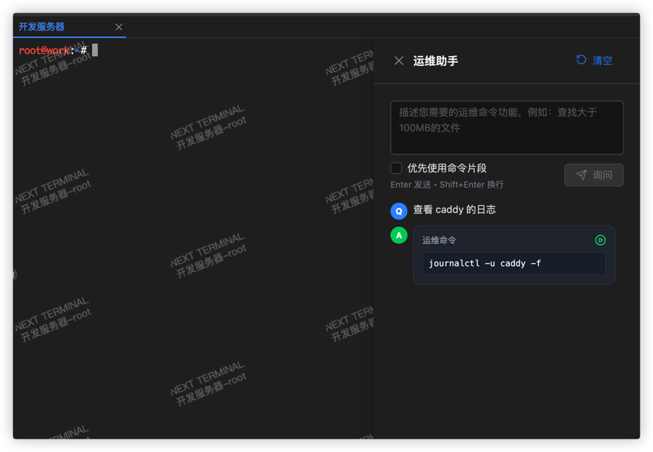
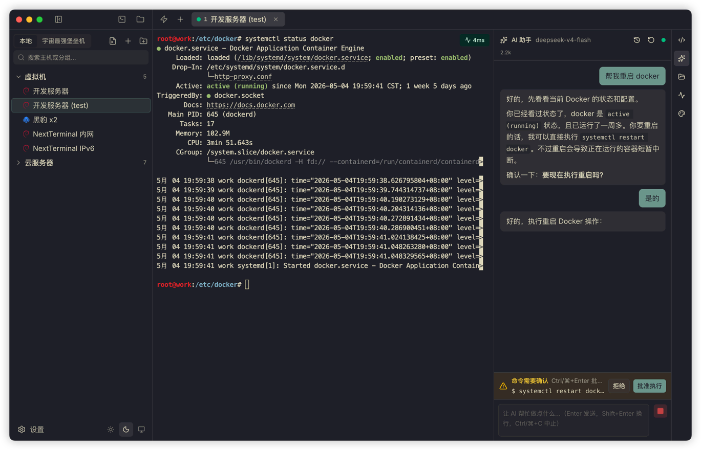
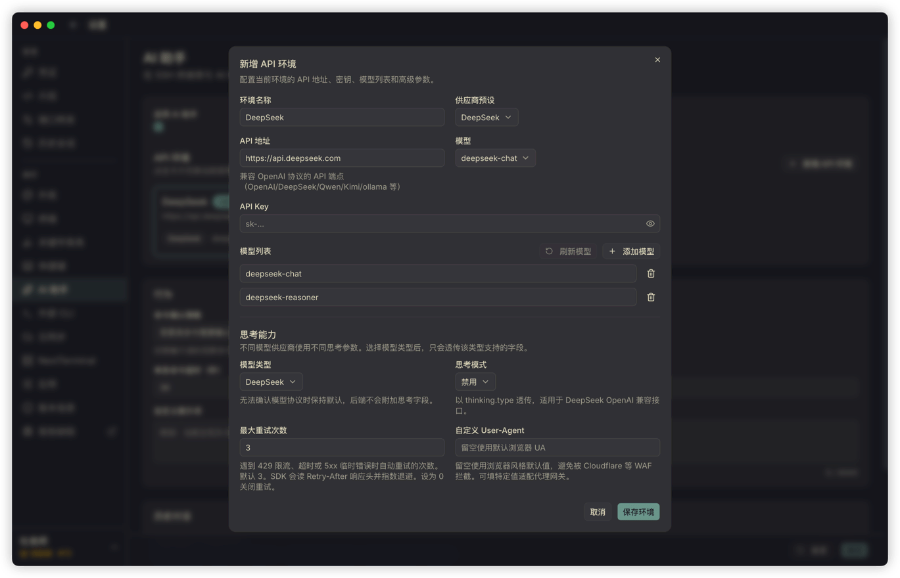
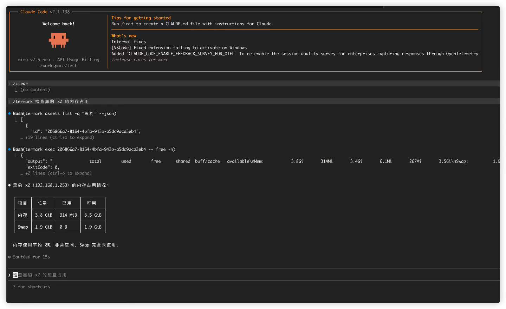

# Termark AI 助手设计：我为什么没有做一个"全自动运维 Agent"

在我另一款产品 NextTerminal 里，我很早就做过一个 AI 助手。

那时候做得很简单：用户在后台配置 API、模型和提示词，打开终端后可以在旁边问一句"这个命令怎么写"。AI 给出命令，用户看一眼再决定要不要执行。



功能不复杂，但当时反馈还不错。它解决的问题很具体：人在终端里工作，往往不是完全不会，而是需要一个能快速给出方向的助手，比如查日志、看进程、写一条 `grep`、解释一段报错、补一个一时想不起来的参数。

但我一直没把它再往前推、做成更激进的"自动运维 Agent"。原因很直白，服务器和代码仓库不是一回事。

代码仓库里 AI 删错文件，多数时候还能从 git 里找回来；Linux 机器上跑错一条命令，掉的可能是日志、配置、数据库文件，甚至直接把一台正在跑业务的机器搞坏。

后来做 Termark，AI 这块本来可以从头选型，上下文怎么给、Agent 形态怎么做、要不要支持外部 Agent，全都可以重来一遍。但 NextTerminal 上那个判断我没改。服务器场景的 AI，目标不是让它做得更多，而是让它在能控制的范围里把效率提上去。

---

## 从一问一答，到真正站在终端旁边

我现在已经离不开 Claude Code、Codex 这类编程 Agent。一个账号额度不够用，也会在不同渠道之间切。

用久了之后再回头看"终端旁边放一个聊天框"的形态，会觉得不太够。真实的排查过程并不是用户问一句、AI 答一句，而是看最近终端输出，判断下一步该查什么，执行一条只读命令，根据结果继续推，必要时再给出修改建议。

所以 Termark 的 AI 助手也得是 Agent 形态。

不过我没让它一上来就拥有一堆复杂能力。Termark 的核心现场是用户当前可见的 SSH 终端，工具边界也就收敛在这个会话里：查看终端环境、执行命令、读取文件、搜索内容，必要时再加目录浏览和文件写入。这些工具最后全部落到当前 SSH 会话上，AI 不能绕过 Termark 自己去连服务器。


和很多 Agent 不太一样的是，Termark 的 AI 直接在用户当前看到的那个终端里执行命令，不会在后台另开一个 shell。

举两个例子。

刚 `su - postgres` 完，问 AI："看一下当前连接数。" 它执行的 `psql` 就跑在 postgres 用户的上下文里，不会莫名其妙跑到 root，也不会因为环境变量不对而报一堆错。

切到了 `/var/log/nginx`，问 AI："最近这几个 access log 里 5xx 多吗？" 它的 `grep` 直接在这个目录下跑，不需要再传绝对路径，也不会跑去别的机器上找。

更实际的好处是，命令如果要求输入数据库密码、二次确认、`vim` 编辑、`sudo` 鉴权，用户可以直接在终端里继续输入。它更像是身边的人把命令敲进当前终端，而不是后台跑的一个自动化脚本。


<!-- 配图建议：AI 在当前终端里执行命令的现场，能看到 AI 输出的命令出现在用户实际终端里（而不是单独的工具结果框），最好包含一个 su 切换用户或目录切换后的上下文 -->

代价是少了一点"纯自动化"的爽感，换来的是现场一致：在哪台机器、哪个用户、哪个目录下做事，用户随时都看得到。

---

## 为什么我没有默认放开所有命令

用 AI Agent 最让人烦的，往往是每一步都要确认。

写代码时反复确认 `ls`、`cat`、`rg`，确实很打断思路。但服务器场景没法照搬这套体验。

Termark 面对的是 SSH 资产，可能是个人 VPS，也可能是生产环境。AI 说"我清理一下临时文件"，背后可能就是一条 `rm -rf`；AI 说"我重启服务看看"，背后可能影响线上流量。差一个字，结果差很远。

我的策略是：明确只读、可观察的命令默认放行；会改变远端状态、无法判断是否安全、或者解析不清楚的命令，都走确认流程。

代码里有一套命令风险判断逻辑，会拆 shell token、识别管道、重定向、子命令、反引号、命令替换。命令里只要出现写入、删除、移动、安装、重启、权限变更、输出重定向这类可能改状态的动作，就要确认。设置里也保留了更保守的一档：所有工具调用都确认。



我没有做"开发者模式：永不确认"那种开关。

不是不信 AI。问题是 Termark 支持 OpenAI 兼容接口，每个人接的模型都不一样，能力和工具调用质量参差不齐。一旦给了"永不确认"的开关，出问题时损失发生在用户的服务器上，不在我这。

---

## 内置 Agent

Termark 内置了一条 OpenAI 兼容的 Agent 路径，给"我想用自己挑的模型，但又不想自己搭一套工具链"的人用。

可以配置不同的 API Profile，OpenAI、DeepSeek、OpenRouter、Qwen、Kimi、Ollama 或自定义接口都行。每个 Profile 单独配置 API 地址、Key、模型列表、当前模型、reasoning 参数、最大重试次数和自定义 User-Agent。




我自己测试时偏向用响应快、成本可控的模型做高频终端辅助。能这样选，是因为 Termark 给模型的上下文比较克制：最近若干行终端输出、当前会话范围、必要的系统提示词，加上用户这次的问题，差不多就这些。它不会把整个服务器状态都塞过去，也不会把所有历史一股脑堆进去。上下文越大成本越高，噪音也越多。

这里面比较关键的一块是最近终端输出。我不希望用户每次都手动复制一段输出再粘给 AI，所以 Termark 会从当前终端抓最近 N 行，自动作为上下文带过去。N 可以在设置里调。

这样刚执行完：

```bash
systemctl status nginx
```

然后问：

```text
帮我看一下为什么没启动
```

AI 就能直接结合刚才的输出来分析，不会反问一句"请提供错误日志"。


日常解释日志、生成排查命令、看配置片段、搜索文件，这点上下文基本够用。

轻量模型当然有它的能力上限。所以内置 Agent 我没把定位拔得太高，它的角色是终端旁边一个能看现场、能有限执行命令的助手，不负责替你跑完整套运维流程。查磁盘、看端口、分析报错都合适；不经确认改生产配置，我并不鼓励。

---

## 外部 CLI：给你本地已有的 Agent 用

还有一类场景反过来。

有些人已经在本地终端里重度用 Codex、Claude Code 或 OpenCode，不愿意切到 Termark 的 AI 面板。问题是这些本地 Agent 默认拿不到用户的 SSH 资产，它不知道密码、私钥、跳板机配置，从安全角度看也不该知道。

Termark 在这里的处理是给一条外部 CLI。

设置页里点几下就能把 `termark` 命令装到 PATH，并且把 Termark skill 装到 Codex、Claude、OpenCode 的 skills 目录里。之后在本地 Agent 里就可以让它去用 termark：

```bash
termark assets list -q <keyword> --json
termark exec <asset-id> -- <command>
termark upload <asset-id> <local-path> <remote-path>
termark download <asset-id> <remote-path> <local-path>
```





外部 CLI 不直接持有凭证。它通过正在跑的 Termark 桌面端访问受控能力，凭证、跳板、连接细节这些都还留在 Termark 里。Agent 拿到的只是一个"对指定资产做点事"的入口。

能做的事比较有限：搜索资产、查看资产基础信息、对指定资产跑一次性命令、上传或下载文件。长任务别让外部 CLI 一直挂着，应该在远端用 `tmux`、`nohup` 或 `systemd` 接住。

它不是要做一个万能 remote agent，只是给已有的 Agent 加一个能安全访问服务器的入口。

---

## 两条路解决两类人

到这里，Termark 在 AI 这块其实给了两个入口。

一个是内置的 OpenAI 兼容 Agent。用户挑自己想用的模型，让 AI 在 SSH 终端旁边看现场、分析问题、执行受控命令，安全靠 Termark 的确认策略兜着。

另一个是外部 CLI。本地 Agent 工作流不变，只是多了一个能安全访问 Termark 资产的命令；凭证不交给 Agent，留在 Termark 这边就行。

我没想强迫用户只用其中一种。有人在乎接入门槛和模型选择，有人在乎已有工作流。两个入口共享同一套资产、凭证、会话和安全策略，差别只是从哪边进来。
