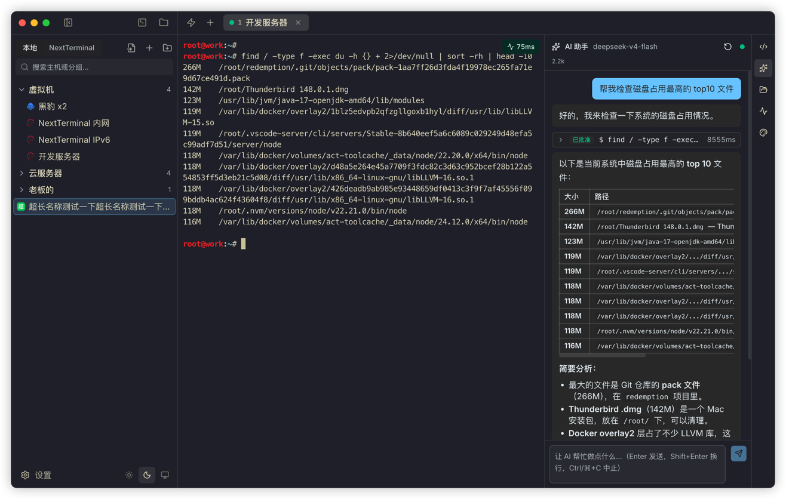
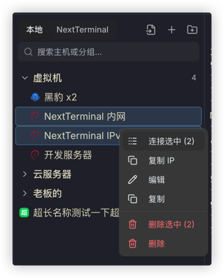
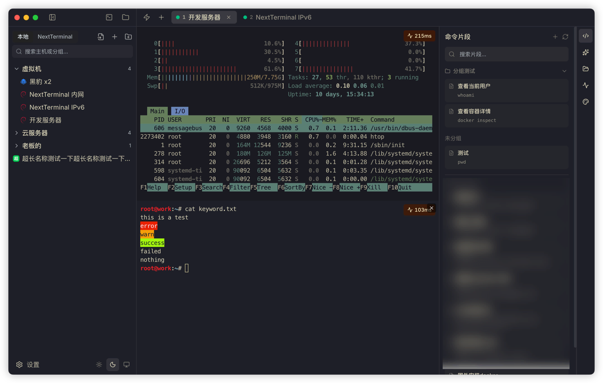
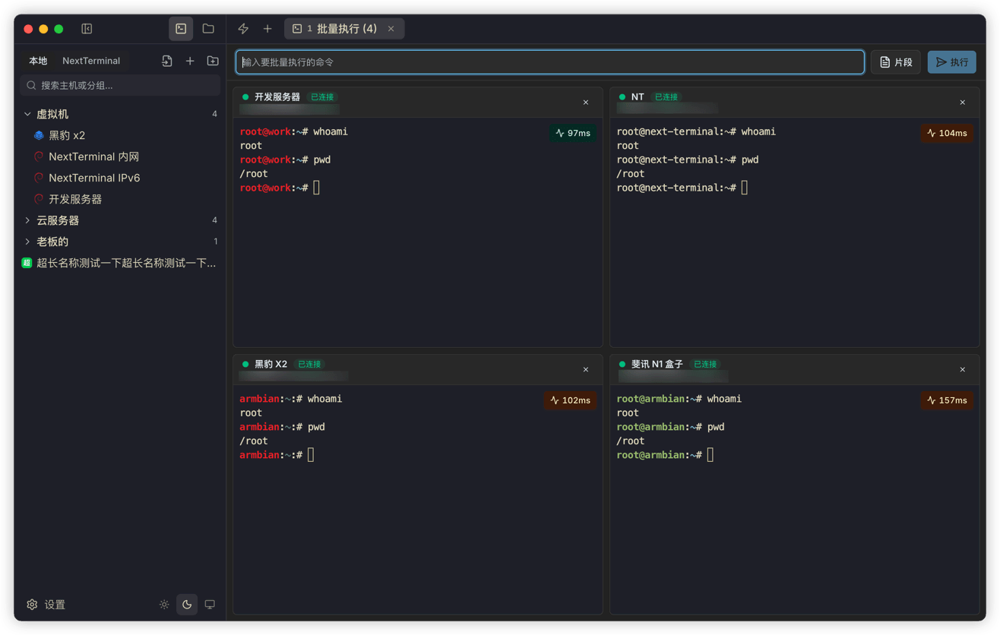
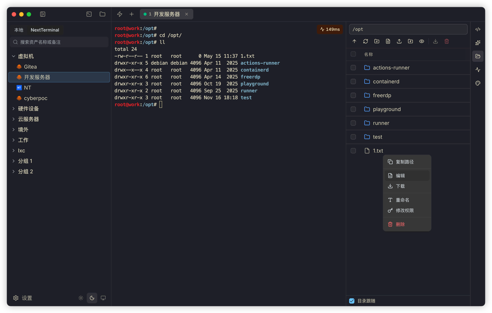
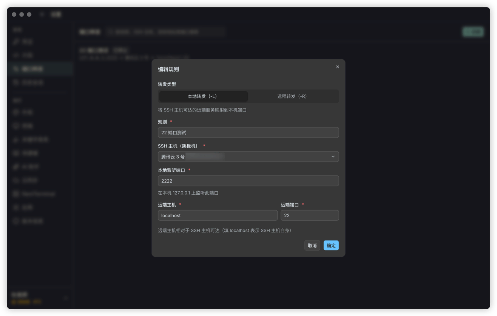
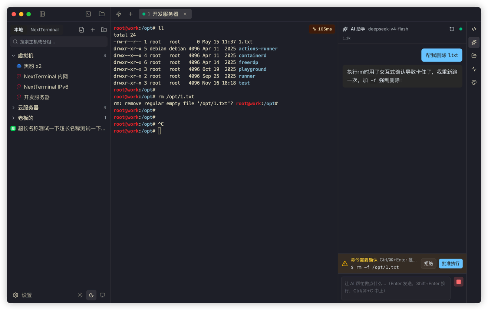
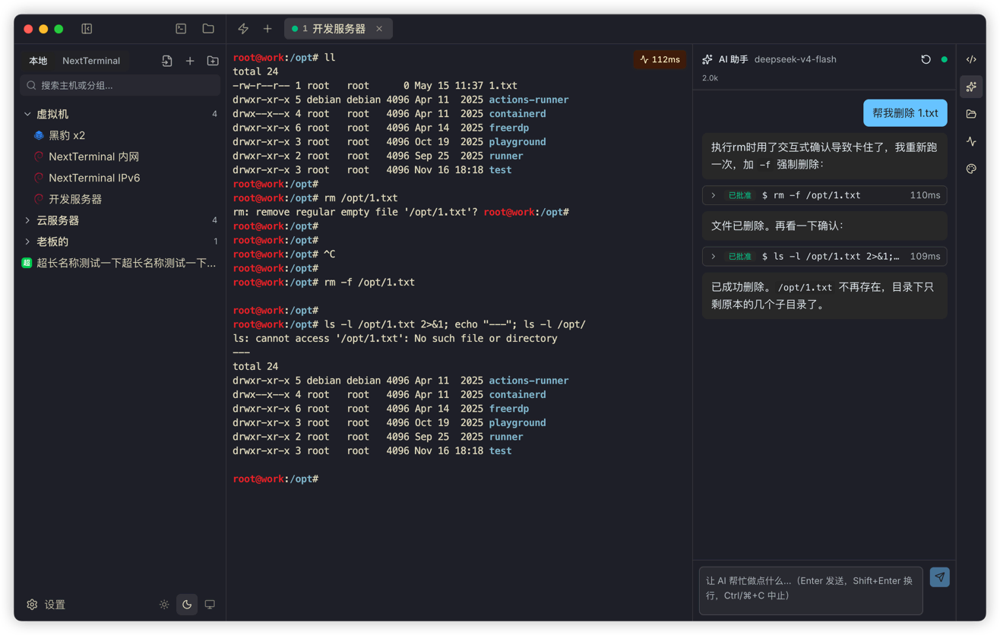
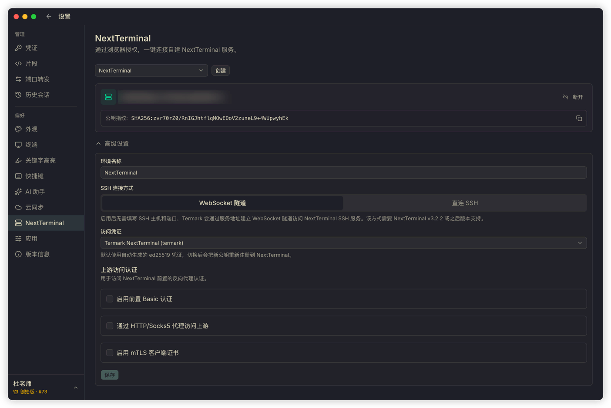
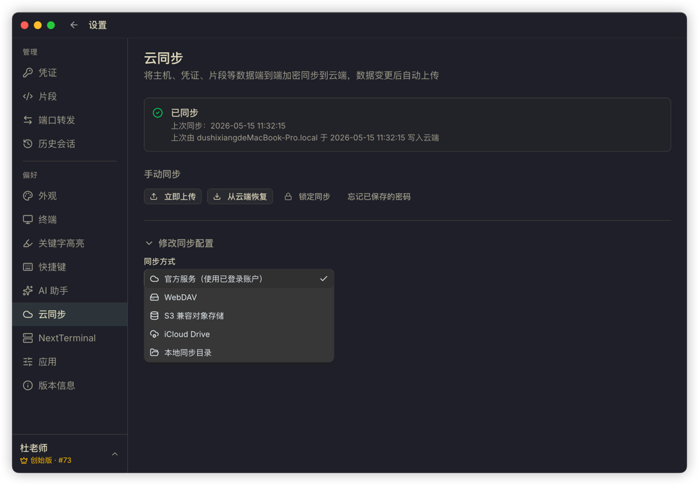

# 如果你经常连服务器，可以试试 Termark

如果你的日常工作里经常出现这些场景：

打开终端连服务器；
在多个标签页之间切换；
找某台机器的账号、密钥、跳板机配置；
临时上传一个配置文件，或者下载一份日志；
在几台机器上重复执行同一条命令；
看着一屏日志，想让 AI 帮忙分析一下，但又不希望它直接替你乱执行命令。

那你可能会需要一个更适合远程工作的桌面工具。

我做的这个工具叫 **Termark**，是一个 SSH 终端管理工具，也可以理解成围绕服务器资产展开的远程工作台。它把资产管理、终端会话、SFTP 文件传输、批量命令、端口转发、命令片段、会话记录、多设备同步和 AI 辅助收在同一个地方。SSH 协议本身已经够好用，Termark 想解决的是"连接之后"的那些碎片。

目前支持 **macOS 和 Windows**，免费版永久免费，**已有 100+ 位付费用户** 在使用。

👉 官网下载：[https://www.termark.app](https://www.termark.app)

---

## 先把服务器资产管起来

Termark 打开后，最左侧是一棵资产树。

你可以按自己的习惯管理服务器——生产环境、测试环境、客户项目、数据库、网关、家里的 NAS。分组多级，可搜索、可拖拽。已有的 `~/.ssh/config` 直接导入，批量迁移可从 CSV 导入。

Termark 不只支持 SSH，也可以管理：**SSH / Telnet / 串口 / 本地终端 / NextTerminal 资产**。

很多人的环境并不"纯净"：有云主机也有内网机器，有些资产已经在 NextTerminal 里。Termark 提供一个统一入口，而不是要求你把所有东西换成同一种管理方式。

---

## 终端要稳定，也要顺手

Termark 的终端基于 xterm.js，支持多标签、分屏、搜索、自动重连、复制会话、关键字高亮、命令片段、主题和快捷键。

我自己很常用的几个点：

- **命令片段**：Docker 清理、systemd 状态检查、磁盘检查、日志过滤这些命令保存起来，不用每次重新敲。
- **关键字高亮**：把 `ERROR` / `WARN` / `failed` / 接口耗时 / 业务关键词标出来，看日志时容易抓重点。
- **复制会话**：从当前 SSH 会话复制一个新标签，自动进入相同目录，排查问题时很方便。

标签滚不滚得动、中文会不会乱码、复制粘贴在不同系统稳不稳——这些细节用起来才有感觉。

---

## 多台机器执行同一条命令

发布后确认多台服务器版本是否一致、批量查看磁盘 / 进程 / 系统负载、对一组机器执行相同的巡检命令——这些操作天然就是批量的。

传统做法是开很多窗口一个个粘贴。Termark 里选择多台资产进入批量执行页面：每台机器有独立终端面板，你在顶部输入一次命令，就发送到所有目标。**输出独立显示**，既能统一下发又能分别观察，也可以直接选择已保存的命令片段。

---

## SFTP 放在终端旁边

文件传输很常见，但很多时候你不是专门要"管理文件"，只是排查过程中顺手要做一件事：上传一份配置、下载一段日志、改个权限。

Termark 内置 SFTP 工作区，双面板结构，左侧本机 / 右侧远程。支持上传、下载、拖拽、批量操作和传输任务查看。SSH 终端里也可以直接打开当前会话对应的 SFTP 标签页。

**开启目录跟随后，终端里切换目录，SFTP 也会贴近当前工作目录**——这比单独打开一个文件传输工具再手动找路径要省事很多。

---

## 端口转发、跳板机、代理

SSH 端口转发好用但命令难记，每次重新拼 `ssh -L` 或 `ssh -R` 都很烦。

Termark 支持本地转发和远程转发，常用规则可以保存下来——把远程 MySQL 映射到本机端口、通过跳板机访问内网服务、临时把本地服务暴露给远端机器。

凭证和连接配置也集中管理：密码 / 私钥 / 多级跳板 / HTTP 与 Socks5 代理 / 老旧主机密钥算法 / SSH keyboard-interactive 认证 / SFTP Sudo 提权 等。这些能力不会每天被提起，但一旦遇到复杂网络环境就很关键。

---

## AI 辅助：站在终端旁边，但控制权还在你手里

Termark 里有 AI 助手。我不太想把它包装成"自动运维"——对服务器工具来说，自动执行命令是一件需要谨慎对待的事。

它更像是站在终端旁边的助手：参考最近的终端输出，帮你分析报错、解释日志、整理下一步排查思路，写一条过滤日志或查看进程的命令，也可以在你确认后执行低风险排查命令。

AI 配置兼容 OpenAI 协议，可以接 **OpenAI / DeepSeek / Qwen / Kimi / ollama / Codex** 等服务，自定义 API 地址、Key 和模型。

命令执行始终保留确认环节。删除、格式化磁盘、重启、关机、清空防火墙这类高风险命令会被识别出来并要求确认。AI 可以提高效率，但服务器的控制权必须在用户手里。

---

## NextTerminal 用户也可以直接接进来

如果你已经在用 NextTerminal，Termark 可以接入。配置时通过浏览器授权，不需要手动创建 API Token。授权后，把 NextTerminal 里的 SSH 资产加载进 Termark 的资产树即可。

支持多个 NextTerminal 环境、WebSocket 隧道、Basic Auth 与 mTLS 上游认证、上游代理设置。

资产可以继续由 NextTerminal 管理，日常连接、SFTP、批量执行、命令片段和 AI 辅助则可以在 Termark 里完成——不需要在已有资产体系和本地桌面工具之间二选一。

---

## 多设备同步，但服务端看不到明文

公司电脑、家里电脑、笔记本和台式机之间切换，资产和命令片段不同步会很影响体验。

Termark 支持：**官方同步服务 / WebDAV / S3 兼容对象存储 / iCloud / 本地目录**。同步内容包括主机、凭证、命令片段和配置等。

安全模型上：**同步数据在客户端加密后再上传，同步密码不会发给服务端，服务端拿到的是密文**。换句话说，服务端只负责保存数据，不能解密你的服务器信息。

多设备同时修改时，Termark 会做版本冲突检测，让你选择从云端恢复或本地覆盖云端，而不是静默覆盖。

---

## 定价：免费版能直接用，进阶能力一次付费

|                                          | **免费版** | **永久授权** |
|------------------------------------------|---|---|
| 价格                                       | **¥0**，永久免费 | **¥149**，一次付费 |
| SSH / SFTP / Telnet / 串口                 | ✅ | ✅ |
| SFTP 目录跟随                                | ✅ | ✅ |
| 命令片段                                     | ✅ | ✅ |
| 端口转发                                     | ✅ | ✅ |
| 历史会话回放                                   | ✅ | ✅ |
| 资产状态监控                                   | ✅ | ✅ |
| 主题切换                                     | ✅ | ✅ |
| 本地加密存储                                   | ✅ | ✅ |
| AI 助手                                    | ✅ | ✅ |
| NextTerminal 堡垒机资产访问                     | ✅ | ✅ |
| **批量执行命令**                               | — | ✅ |
| **SFTP 在线编辑器**                           | — | ✅ |
| **云同步**（官方 / WebDAV / S3 / iCloud / 本地目录） | — | ✅ |
| **端到端加密同步**                              | — | ✅ |
| **多设备登录与授权管理**                           | — | ✅ |
| **优先技术支持**                               | — | ✅ |

免费版不是阉割版试用——SSH、SFTP、端口转发、AI、命令片段这些日常核心都直接能用。如果你需要批量执行、端到端加密同步、多设备授权管理，再升级永久授权，**¥149 一次付费，后续版本免费用**。

---

## 用户怎么说

<!--
TODO: 以下 3 条为占位文案，请用真实反馈替换后再发布。
建议从用户群（QQ / 微信 / Telegram / Discord）、邮件、GitHub Issues、V2EX / 小红书 / X 上挑选已有的真实反馈，昵称可匿名化处理。
-->

> "AI 助手太强了，日常运维解放大脑了。"

> "最看中的是同步数据端到端加密，公司电脑和家里电脑切换不用再担心凭据明文上云。"

> "SFTP 侧面板 + 终端目录跟随，这个组合真的回不去了。"

---

## 它适合哪些人

Termark 更适合经常和服务器打交道的人：

- 后端开发
- 运维和 SRE
- 自己维护服务器的独立开发者
- 经常处理客户服务器的技术支持
- 有多台云服务器、NAS、内网机器的人
- 已经在使用 NextTerminal、又想要一个本地桌面终端工作台的人

如果你只偶尔登录一台服务器，它可能不是刚需。但如果你经常在终端、SFTP、笔记、密码管理、跳板机配置、AI 对话和多个窗口之间切来切去，Termark 会更有价值。

---

## 最近的迭代

- AI 支持 Codex，模型切换和命令确认策略更清楚
- NextTerminal 支持多环境、WebSocket 隧道、上游认证和上游代理
- 同步方式增加 iCloud 和本地目录
- 资产树支持 Shift 范围多选、批量连接和展开分组
- 命令片段、关键字高亮规则支持拖拽排序
- 终端主题、快捷键、外观设置重新整理
- 增加 SSH keyboard-interactive 认证和更多兼容老旧服务器的能力
- 修复一批 macOS、Windows、SFTP、AI、同步和终端显示的问题

---

## 限时兑换码

为了让更多人先用起来，这次准备了 **首发 50 个 1 年授权兑换码**。

获取方式：

1. 关注公众号
2. 回复 **「Termark」** 获取兑换码
3. 访问 [https://license.termark.app/](https://license.termark.app/) 完成兑换

活动截止 **2026 年 5 月 22 日**，先到先得。

---

## 最后

Termark 是一个桌面端 SSH 终端管理工具，目前支持 macOS 和 Windows。

资产在这里，终端在这里，文件传输在这里，命令片段在这里，端口转发在这里，会话记录在这里，AI 助手也在这里。

**少一点窗口切换，少一点重复配置，少一点复制粘贴。**

👉 现在就去下载：[https://www.termark.app](https://www.termark.app)
