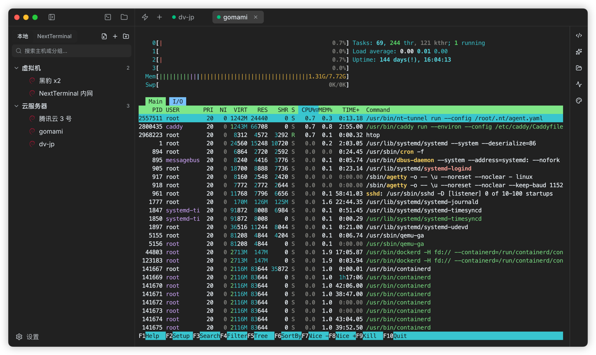
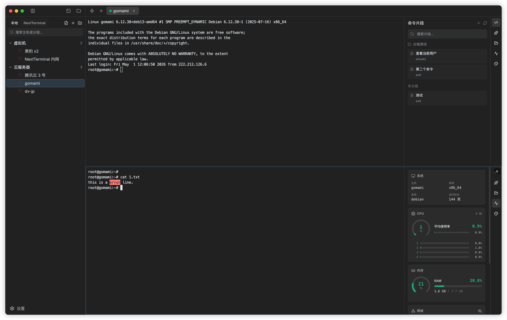
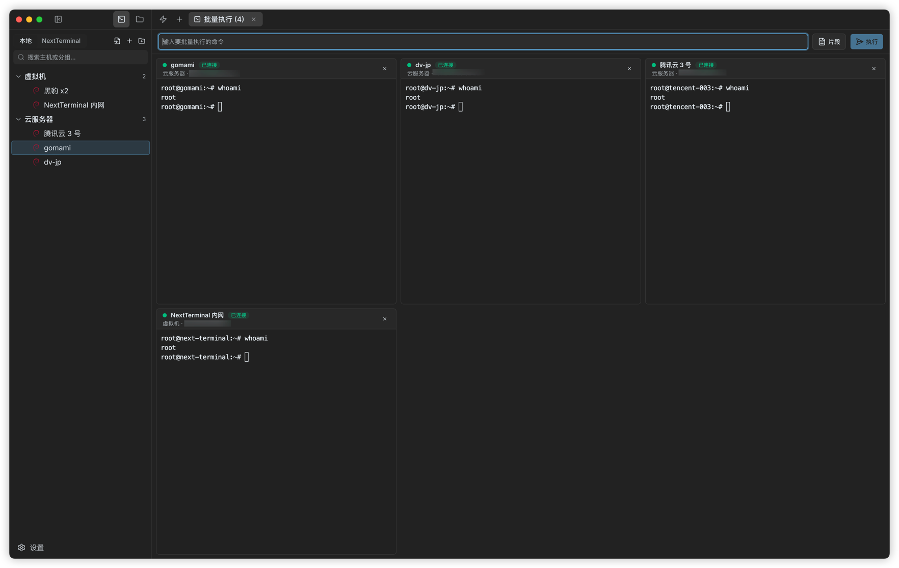
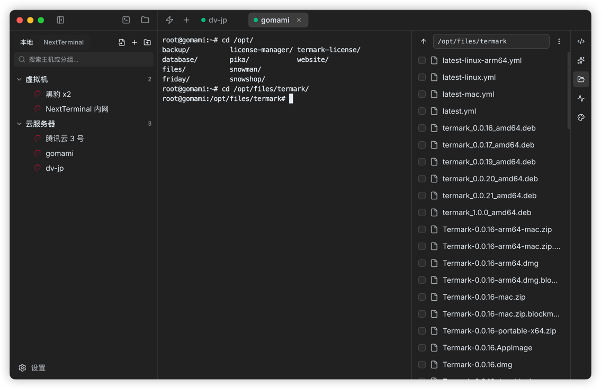
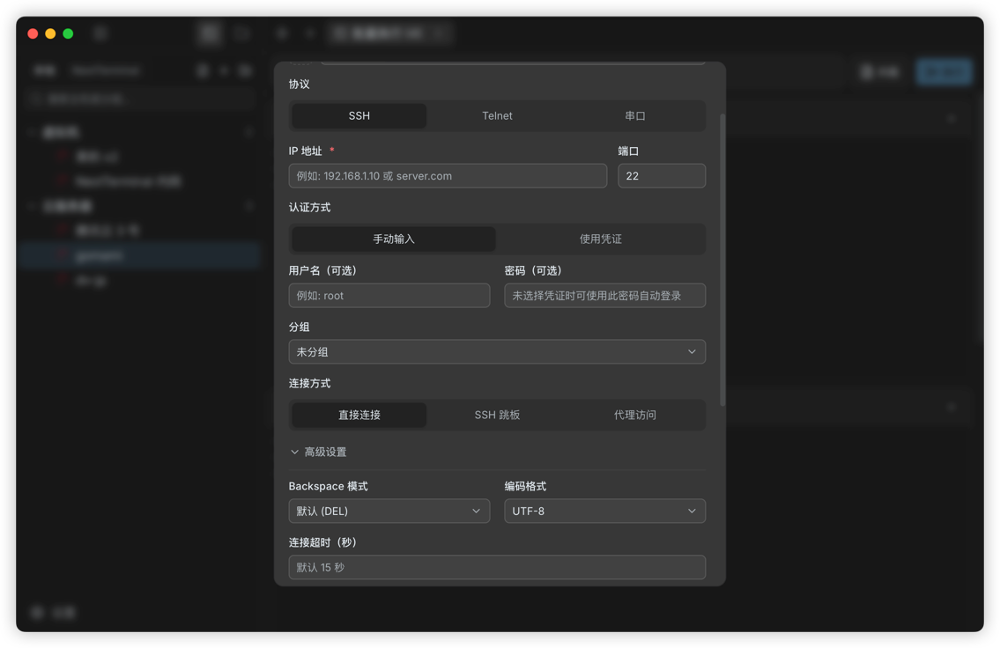
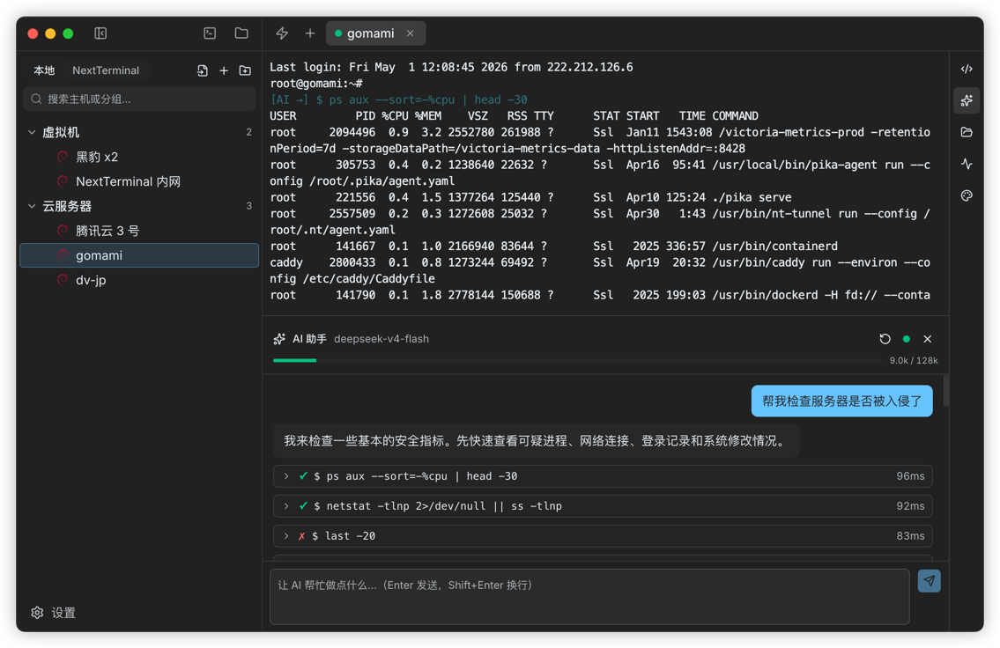
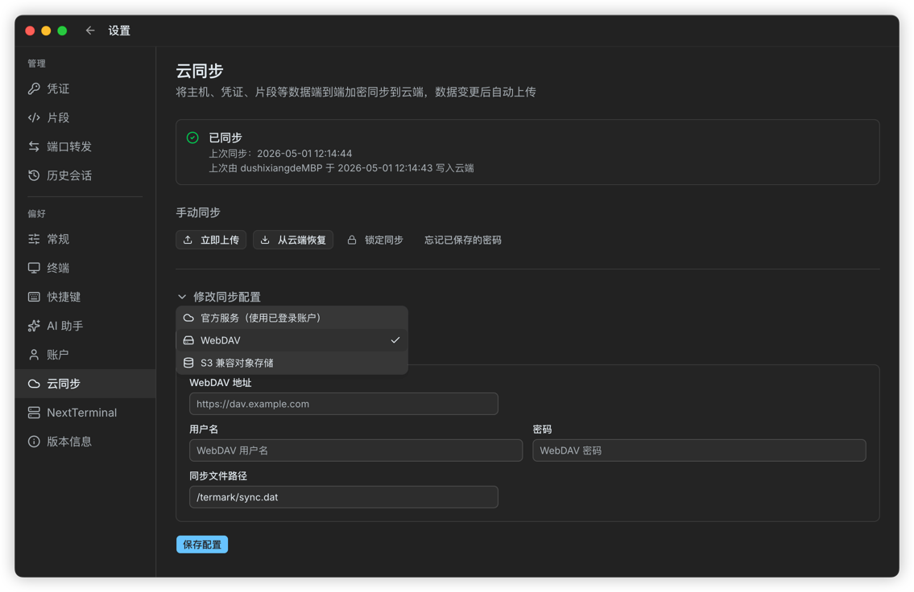

# 我做了一个更顺手的 SSH 终端管理工具：Termark

做后端、运维或者自己折腾服务器的人，应该都很熟悉这种工作状态：

打开终端，连服务器；  
再打开另一个工具传文件；  
再翻笔记找一条命令；  
再去找某台机器的账号、密钥、跳板机配置；  
临时要在几台机器上执行同一条命令，又开始一个窗口一个窗口复制粘贴。

这些事情单独看都不难，但每天重复很多次，就会变得很碎。

Termark 就是为了解决这种「碎」而做的。

它是一个桌面端 SSH 终端管理工具。我希望它不只是一个能连服务器的终端，而是把资产管理、终端会话、文件传输、端口转发、命令片段、会话记录、同步和 AI 辅助这些日常动作放在同一个工作台里。

---

## 为什么要做 Termark

我自己平时用服务器比较多，常见的工作流并不复杂，但很容易被不同工具拆散。

比如排查一个线上问题，可能需要先连到跳板机，再进目标机器，看日志、查进程、看端口、拉配置文件、下载日志、临时开一个端口转发。过程中如果还要处理多台机器，就更麻烦。

终端本身只解决了「连上去」这一步，但很多真实工作发生在连接之后。

所以 Termark 的思路是：先把服务器资产管好，再围绕资产提供常用操作。

一台机器不应该只是一个 IP 地址。它可能属于某个环境，有自己的凭证、代理、跳板、启动命令、文件传输入口、历史会话和常用命令。Termark 尽量把这些东西放在一起。

---

## 先从资产树开始

Termark 打开后，最左侧是一棵资产树。

你可以按自己的习惯给服务器分组：生产、测试、数据库、网关、客户项目、家里的 NAS，怎么顺手怎么来。分组支持多级，也支持搜索和拖拽排序。

如果你已经有 `~/.ssh/config`，也可以直接导入，没必要重新录一遍。需要批量迁移时，也可以从 CSV 导入。

Termark 支持的不只是 SSH 主机。现在可以管理和连接：

- SSH
- Telnet
- 串口
- 本地终端
- NextTerminal 资产

这里我比较在意的是「统一入口」。有些老设备还在用 Telnet，有些现场设备靠串口，有些团队已经有 NextTerminal。它们不一定先进，但是真实存在，也需要被工具照顾到。

---

## 终端要顺手，而不是只做到能用

终端部分基于 xterm.js。基础的连接、输入输出只是第一层，真正影响体验的是日常细节。

Termark 支持多标签、分屏、搜索、复制会话、自动重连、选中复制、右键粘贴、主题、字体、快捷键和关键字高亮。

这些都不是特别新奇的功能，但我觉得它们必须稳定地待在一个终端工具里。因为真正使用时，少一次切换、少一次重复输入、少一次找命令，体验就会好很多。

我自己比较常用的是命令片段。

比如 Docker 清理、查看 systemd 服务状态、查看最近错误日志、检查磁盘、重启某个服务，这些命令不值得每次重新敲，也不应该散落在聊天记录和笔记软件里。保存成片段后，打开终端就能直接用。

关键字高亮也很实用。你可以把 `ERROR`、`WARN`、`failed`、`success` 这类词标出来。看日志时不需要一行一行硬扫，视线能更快抓到重点。

---

## 多台机器上重复执行命令，应该简单一点

有些事情天然就是批量的。

比如看一组机器的磁盘空间，检查某个服务是不是都起来了，确认几台服务器上的版本是否一致，或者在发布之后批量验证结果。

传统做法通常是开很多窗口，一个个粘贴命令。能做，但很机械，也容易漏。

Termark 里可以选择多台资产，然后打开批量执行页面。每台机器会有自己的终端面板，你在顶部输入一次命令，就可以发到所有目标机器。

输出不会混在一起，每台机器还是独立终端。这样既能统一下发，又能分别观察。

如果你已经把常用命令保存成片段，也可以在批量执行里直接选片段。

---

## SFTP 放在终端旁边

文件传输是另一个经常被拆出去的动作。

很多时候我们不是专门去「管理文件」，只是排查过程中顺手要上传一个配置、下载一份日志、改一个小文件、看一下目录结构。

所以 Termark 做了内置 SFTP 工作区。它是双面板结构，左边可以是本机，右边可以是远程服务器，也可以选择不同资产。

常见操作都放进去了：上传、下载、拖拽、新建文件夹、新建文件、重命名、删除、修改权限、批量下载、批量删除、查看传输任务。

在 SSH 终端里，也可以打开当前会话对应的 SFTP 标签页。目录跟随开启后，终端里切换目录，SFTP 也能更贴近当前工作目录。

这类功能不需要讲得很复杂，核心就是一句话：不用为了传一个文件再切到另一个工具。

---

## 端口转发也可以保存成规则

SSH 端口转发很好用，但命令不太好记，尤其是转发多了之后，很容易忘记哪条命令对应哪个服务。

Termark 支持本地转发和远程转发，可以把规则保存下来。

比如：

- 把远程 MySQL 映射到本机端口
- 通过跳板机访问内网服务
- 临时把本地调试服务暴露给远端机器
- 调试服务器网络里才能访问的接口

规则保存之后，需要时点一下启动，不需要时停掉。比起每次重新拼 `ssh -L` 或 `ssh -R`，更适合长期使用。

---

## 凭证、跳板、代理这些麻烦配置，也尽量收起来

服务器连接里真正麻烦的经常不是 IP，而是配套信息。

账号是什么？用密码还是私钥？私钥有没有口令？要不要走代理？要不要经过跳板机？有几级跳板？连接后要不要执行启动命令？老机器编码是不是特殊？

这些信息如果分散保存，迟早会乱。

Termark 内置了凭证管理，可以保存密码凭证和私钥凭证，也支持生成密钥对，复制公钥或安装命令。主机可以直接绑定凭证，避免重复输入。

连接方式上，也支持 SSH 直连、多级跳板、HTTP 代理、Socks5 代理、连接超时、环境变量、Backspace 模式、编码配置和 SFTP Sudo 提权模式。

本地存储方面，密码、私钥、密钥口令、代理密码这类敏感字段会加密落盘，不会直接以明文保存。

---

## 会话历史：有些输出值得留下来

排障时经常会出现一种情况：当时终端里明明有关键输出，过一会儿想回头看，却找不到了。

Termark 支持会话录制。开启后，终端输出可以保存到历史会话里，后续可以回放，也可以加备注和搜索。

它适合记录这些场景：

- 一次问题排查过程
- 一次部署输出
- 一次关键配置变更
- 一次误操作复盘
- 某台机器的历史连接记录

这不是为了做复杂审计，更像是给个人和小团队留一个轻量记录。很多时候，能回看一遍当时发生了什么，就已经很有价值。

---

## AI 助手：可以帮忙，但不能替你做主

Termark 里也做了 AI 助手。

我不太想把它包装成「自动运维」这种东西。它更像是站在 SSH 终端旁边的助手：能看到最近终端输出，能根据你的描述分析问题，也能在你确认后执行一些命令。

比如你可以让它帮你看一段报错，检查服务状态，分析端口占用，或者根据当前输出判断下一步该查什么。

AI 助手支持兼容 OpenAI 协议的接口。你可以配置自己的 API 地址、Key 和模型，比如 OpenAI、DeepSeek、Qwen、Kimi、ollama 等兼容服务。

执行命令这件事我做得比较谨慎。

Termark 支持两种确认策略：只对危险命令确认，或者每条命令都确认。像 `rm -rf /`、`mkfs`、`dd` 写磁盘、重启、关机、清空防火墙这类高风险命令，会被识别出来并要求确认。

我的想法是：AI 可以提高效率，但服务器上的控制权必须还在用户手里。

---

## 多设备同步，但服务端看不到明文

如果你在公司电脑、家里电脑或者多台开发机之间切换，资产和命令片段不同步会很烦。

Termark 支持云同步，可以同步主机、凭证、片段和配置。同步方式支持官方服务、WebDAV 和 S3 兼容对象存储。

这里比较重要的是安全模型：同步数据在客户端加密后再上传。同步密码不会发给服务端，服务端拿到的是密文。换句话说，服务端只负责保存数据，不负责也不能解密你的服务器信息。

多设备同时修改时，Termark 会做版本冲突检测。如果发现冲突，会让你选择从云端恢复，或者用本地数据覆盖云端，而不是静默覆盖。

---

## 如果你已经有 NextTerminal

Termark 也集成了 NextTerminal。

配置时通过浏览器授权，不需要手动去创建 API Token。授权后，可以把 NextTerminal 里的 SSH 资产加载进 Termark 的资产树。

这样就不必在已有资产体系和本地桌面工具之间二选一。资产仍然可以由 NextTerminal 管理，日常连接、SFTP、批量执行、命令片段和 AI 辅助则可以在 Termark 里完成。

---

## 它适合谁

如果你只是偶尔登录一台服务器，Termark 可能不是刚需。系统终端加一条 SSH 命令已经够了。

但如果你经常面对这些情况，Termark 会更有用：

- 服务器数量比较多
- 经常需要跳板机或代理
- 常用命令很多，不想重复敲
- 经常需要上传下载文件
- 需要批量检查多台机器
- 希望保留一部分会话历史
- 想把 AI 接到真实 SSH 会话旁边辅助排查
- 想在多台电脑之间同步资产和配置

它不是想替代所有工具，而是想把最常用的远程工作流收进一个桌面应用里。

少一点窗口切换，少一点重复配置，少一点复制粘贴。

这就是 Termark 目前最想解决的问题。

---

## 最后

Termark 还在持续迭代。

如果你也经常和服务器打交道，欢迎试试，也欢迎反馈你真实的使用场景。很多功能不是凭空想出来的，都是从日常工作里一点点长出来的。

官网：<https://termark.app>

关注公众号发送「加群」，加入讨论群，获取最新动态。

