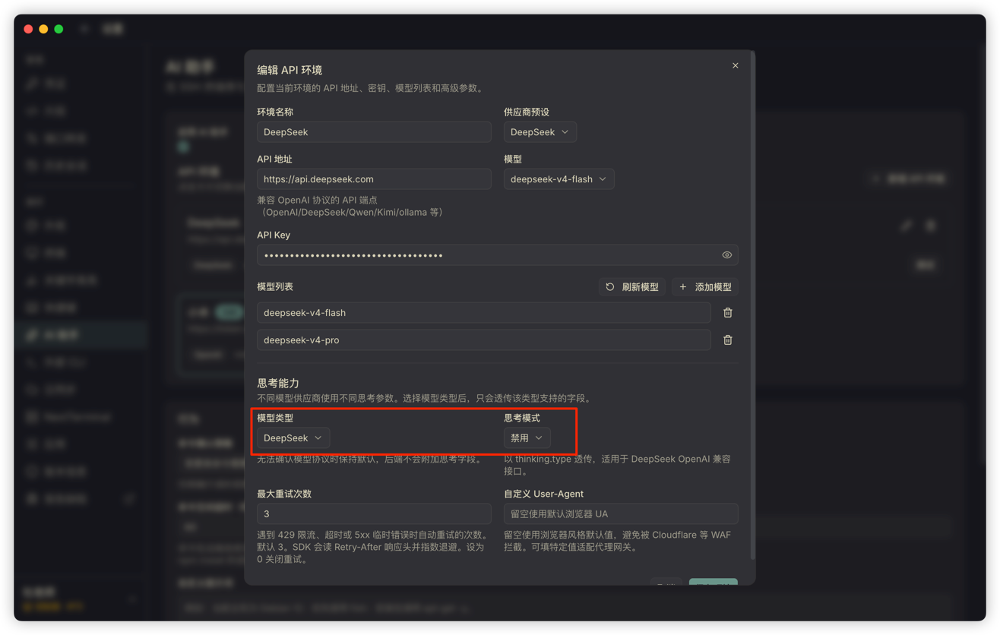

# AI Agent 使用说明

## 模型思考模式错误

如果使用 DeepSeek/小米 的模型时看到类似下面的错误：

```text
[400] The 'reasoning_content' in the thinking mode must be passed back to the API.
```

通常是因为当前模型开启了思考模式、推理模式或 Thinking 模式。部分大模型服务会要求客户端在后续请求中回传 `reasoning_content`，但 Termark 当前不支持大模型思考内容的透传和回传，因此无法兼容这类思考模式。

遇到这个错误时，请在 AI 设置中禁用模型思考功能：

- 将 reasoning、thinking、推理模式或思考模式设置为关闭。
- 如果模型提供 `enable_thinking`、`thinking`、`reasoning` 等参数，请关闭或选择 disabled/off。
- 如果当前模型强制开启思考模式，请切换到支持关闭思考的模型。

禁用思考后，AI Agent 仍然可以正常对话、分析终端输出和执行受控命令。只是模型不会返回单独的思考内容，Termark 也不会处理大模型的思考过程。



## 为什么需要禁用思考

Termark 的 AI Agent 面向 SSH 终端辅助场景，会把最近终端输出、用户问题和必要工具调用发送给模型。当前实现只处理普通对话内容和工具调用结果，不处理模型内部思考内容。

因此，启用思考模式可能导致以下问题：

- API 返回 `reasoning_content` 相关错误。
- 模型服务要求客户端回传思考内容，但 Termark 不支持。
- 工具调用上下文无法继续，AI Agent 中断响应。

如果你的模型服务默认开启思考模式，建议单独为 Termark 创建一个关闭思考的模型配置。
